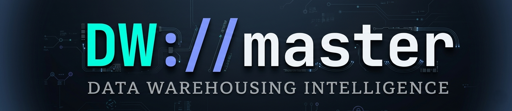
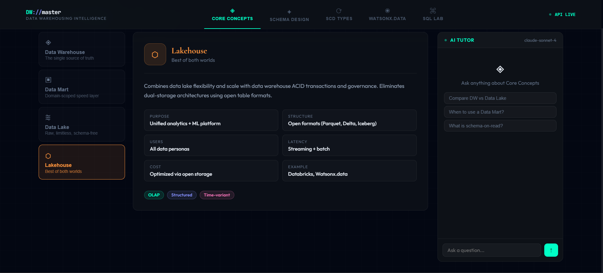
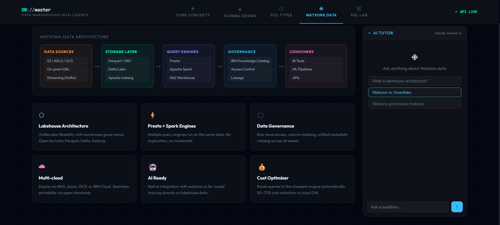

# DW://master — Data Warehousing Intelligence Platform




<p align="center">
  
  
  
  
</p>

---

## Overview

DW://master is an interactive learning platform for data warehousing concepts, featuring:

- **5 Core Modules** covering foundational DW concepts
- **Interactive Schema Design** (Star vs Snowflake)
- **SCD Type Simulations** (Type 0–4)
- **AI-Powered Tutor** (Claude Sonnet 4)
- **SQL Lab** with AI assistance

---

## ✨ Key Features

### 🏛️ **5 Core Modules**

| Module                        | Focus                                 | Interactive Features                                          |
| ----------------------------- | ------------------------------------- | ------------------------------------------------------------- |
| **01 — Core Concepts** | DW, Data Mart, Data Lake, Lakehouse   | Tabbed comparison, attribute cards, concept chips             |
| **02 — Schema Design** | Star vs Snowflake                     | Interactive SVG diagrams, hover to inspect, comparison matrix |
| **03 — SCD Types**     | Type 0–4 Slowly Changing Dimensions  | Live simulations, row animations, type selector               |
| **04 — Watsonx.data**  | IBM Lakehouse Architecture            | Feature cards, architecture flow, multi-cloud                 |
| **05 — SQL Lab**       | GROUP BY, CUBE, ROLLUP, GROUPING SETS | Live query results, AI SQL generator, syntax highlighting     |

### 🤖 **AI Tutor — Claude Sonnet 4**

| Module                  | Context Prompt                          | Sample Questions                                          |
| ----------------------- | --------------------------------------- | --------------------------------------------------------- |
| **Core Concepts** | Data Warehouses, Data Marts, Data Lakes | "Compare DW vs Data Lake", "When to use a Data Mart?"     |
| **Schema Design** | Star vs Snowflake                       | "When to use Star Schema?", "Denormalization tradeoffs"   |
| **SCD Types**     | Slowly Changing Dimensions 0–4         | "What is SCD Type 2?", "Banking compliance SCD choice"    |
| **Watsonx.data**  | Lakehouse architecture, IBM features    | "What is lakehouse architecture?", "Watsonx vs Snowflake" |
| **SQL Analytics** | GROUP BY, CUBE, ROLLUP, GROUPING SETS   | "CUBE vs ROLLUP difference", "When use GROUPING SETS?"    |

---

## 🏛️ **Module 01: Core Concepts**

### **4 Key Data Architecture Concepts** 📊

| Concept                  | Icon | Color       | Tagline                       | Key Attributes                                                                                                                 |
| ------------------------ | ---- | ----------- | ----------------------------- | ------------------------------------------------------------------------------------------------------------------------------ |
| **Data Warehouse** | ◈   | `#00ffc6` | "The single source of truth"  | Purpose: Enterprise-wide analytics · Users: Analysts, executives · Latency: Batch T+1 · Example: Snowflake                  |
| **Data Mart**      | ▣   | `#818cf8` | "Domain-scoped speed layer"   | Purpose: Department-specific · Users: Sales, Finance, HR · Latency: Near-real-time · Example: Sales Mart                    |
| **Data Lake**      | ≋   | `#38bdf8` | "Raw, limitless, schema-free" | Purpose: ML training, exploration · Users: Data scientists · Latency: Real-time · Example: S3 + Glue                        |
| **Lakehouse**      | ⬡   | `#fb923c` | "Best of both worlds"         | Purpose: Unified analytics + ML · Users: All data personas · Latency: Streaming + batch · Example: Databricks, Watsonx.data |

### **Interactive Features** ✨

- **Left navigation** with icon buttons
- **Animated fade-up transitions** when switching concepts
- **Attribute grid** showing 6 key characteristics
- **Concept chips** for quick reference tags
- **Gradient accent border** matching concept color



---

## 📐 **Module 02: Schema Design — Star vs Snowflake**

### **Interactive SVG Diagrams** 🖼️

| Schema                     | Nodes | Edges | Fact Table | Dimensions                                                      |
| -------------------------- | ----- | ----- | ---------- | --------------------------------------------------------------- |
| **Star Schema**      | 5     | 4     | FACT_SALES | DIM_DATE, DIM_PRODUCT, DIM_CUSTOMER, DIM_STORE                  |
| **Snowflake Schema** | 6     | 5     | FACT_SALES | DIM_PRODUCT → DIM_CATEGORY, DIM_CUSTOMER → DIM_CITY, DIM_DATE |

### **Visual Features** 🔍

- **Hover any node** to highlight connections
- **Animated dashed connectors** between tables
- **Field lists** displayed inside fact table
- **Color coding**:
  - 🔵 Fact tables — blue (`#38bdf8`)
  - 🟢 Dimensions — teal (`#00ffc6`)
  - 🟣 Sub-dimensions — pink (`#f472b6`)

### **Comparison Matrix** 📊

| Metric                | Star Schema | Snowflake Schema |
| --------------------- | ----------- | ---------------- |
| **Read Speed**  | 🟢 Fast     | 🟡 Slower        |
| **Write Speed** | 🟡 Slower   | 🟢 Faster        |
| **Storage**     | 🟡 More     | 🟢 Less          |
| **Complexity**  | 🟢 Low      | 🟡 Higher        |
| **Ideal for**   | OLAP / BI   | OLTP / DW        |


---

## 🔄 **Module 03: Slowly Changing Dimensions (SCD)**

### **5 SCD Types** 📊

| Type             | Title           | Color       | Description                                                             |
| ---------------- | --------------- | ----------- | ----------------------------------------------------------------------- |
| **Type 0** | Retain Original | `#94a3b8` | Static. No updates ever allowed. Values are locked at creation.         |
| **Type 1** | Overwrite       | `#f472b6` | Simply overwrite old value. No history is kept.                         |
| **Type 2** | Add New Row     | `#00ffc6` | Insert a new versioned row. Full history preserved via effective dates. |
| **Type 3** | Add Column      | `#818cf8` | Store previous value in a new column. Limited to one prior version.     |
| **Type 4** | History Table   | `#fb923c` | Maintain a separate history table. Current values remain fast to query. |

### **Live Simulation** 🎮

- **Initial state**: Customer "Jane Doe" at "123 Old St"
- **Apply change**: "Jane Doe moved to 456 New Ave"
- **Watch each SCD type handle it differently**:
  - **Type 1**: Overwrites address directly (no history)
  - **Type 2**: Adds new row with start/end dates, deactivates old
  - **Type 3**: Adds "previous address" column
  - **Type 4**: (Simulated in separate history table)

### **Visual Feedback** ✨

- **Row flash animation** when changes occur
- **Color-coded rows** by SCD type
- **Status badges** for current/active rows
- **Date tracking** for Type 2 (start/end)


---

## ⬡ **Module 04: Watsonx.data — IBM Lakehouse**

### **5-Layer Architecture** 🔧

| Layer                   | Components                                     | Color       |
| ----------------------- | ---------------------------------------------- | ----------- |
| **Data Sources**  | S3/ADLS/GCS, On-prem DBs, Streaming (Kafka)    | `#fb923c` |
| **Storage Layer** | Parquet/ORC, Delta Lake, Apache Iceberg        | `#00ffc6` |
| **Query Engines** | Presto, Apache Spark, Db2 Warehouse            | `#818cf8` |
| **Governance**    | IBM Knowledge Catalog, Access Control, Lineage | `#38bdf8` |
| **Consumers**     | BI Tools, ML Pipelines, APIs                   | `#f472b6` |

### **6 Key Features** ✨

| Icon | Feature                          | Description                                                                                | Color       |
| ---- | -------------------------------- | ------------------------------------------------------------------------------------------ | ----------- |
| ⬡   | **Lakehouse Architecture** | Unifies lake flexibility with warehouse governance. Open formats: Parquet, Delta, Iceberg. | `#38bdf8` |
| ⚡   | **Presto + Spark Engines** | Multiple query engines run on the same data. No duplication, no movement.                  | `#00ffc6` |
| 🛡   | **Data Governance**        | Row-level access, column masking, unified metadata catalog across all assets.              | `#818cf8` |
| ☁   | **Multi-cloud**            | Deploy on AWS, Azure, GCP, or IBM Cloud. Seamless portability via open standards.          | `#f472b6` |
| 🤖   | **AI Ready**               | Native integration with watsonx.ai for model training directly on lakehouse data.          | `#fb923c` |
| 💰   | **Cost Optimizer**         | Route queries to the cheapest engine automatically. 50–70% cost reduction vs cloud DW.    | `#a78bfa` |




---

## ⌘ **Module 05: SQL Analytics Lab**

### **4 Query Types** 📊

| Query                   | Label             | Example                                                 | Output                            |
| ----------------------- | ----------------- | ------------------------------------------------------- | --------------------------------- |
| **GROUP BY**      | Basic Aggregation | `SUM(sales) GROUP BY autoclassname`                   | 4 rows, total sales per car class |
| **CUBE**          | All permutations  | `GROUP BY CUBE(salesperson, autoclass)`               | Subtotals + grand total           |
| **ROLLUP**        | Hierarchical      | `GROUP BY ROLLUP(year, month)`                        | Month → Year → Grand Total      |
| **GROUPING SETS** | Custom groupings  | `GROUP BY GROUPING SETS ((salesperson), (autoclass))` | Salesperson totals + class totals |

### **Interactive Results** 📋

- **Formatted output** with currency styling
- **NULL values** displayed as "—" or "NULL"
- **Key insights** panel explaining each query type
- **Animated row entrance** with staggered timing

### **AI SQL Generator** 🤖

- **Natural language to SQL**: Describe what you want
- **Powered by Claude Sonnet 4**: Generates accurate SQL
- **Live streaming response** with typing cursor
- **Syntax highlighting** in generated code

**Example inputs:**

- "Total sales by region and year with subtotals using ROLLUP"
- "Sales per product category with grouping sets for product and region"
- "CUBE query showing all combinations of salesperson and car class"


---

## 🤖 **AI Tutor — Powered by Claude Sonnet 4**

### **Module-Specific Context** 🎓

| Module             | System Prompt                                                                                                                   |
| ------------------ | ------------------------------------------------------------------------------------------------------------------------------- |
| **Concepts** | "You are an expert data engineering tutor explaining Data Warehouses, Data Marts, and Data Lakes. Be concise and use examples." |
| **Schemas**  | "You are an expert explaining Star Schema vs Snowflake Schema design in data warehousing. Focus on practical tradeoffs."        |
| **SCD**      | "You are a data modeling expert explaining Slowly Changing Dimensions (SCD) Types 0–4 with real-world scenarios."              |
| **Watsonx**  | "You are an IBM Watsonx.data specialist explaining its lakehouse architecture, features, and enterprise use cases."             |
| **SQL**      | "You are a SQL expert explaining GROUP BY, CUBE, ROLLUP, and GROUPING SETS aggregation functions with examples."                |

### **Chat Interface** 💬

- **Pulsing status dot** indicating active connection
- **Message history** with user/AI distinction
- **Typing cursor** during streaming responses
- **Loading indicators** with animated dots
- **Suggestion chips** for quick questions
- **Auto-scroll** to latest messages

### **Suggestion Examples** 💡

| Module             | Suggestions                                                                                   |
| ------------------ | --------------------------------------------------------------------------------------------- |
| **Concepts** | "Compare DW vs Data Lake", "When to use a Data Mart?", "What is schema-on-read?"              |
| **Schemas**  | "When to use Star Schema?", "Explain denormalization tradeoffs", "Star vs Snowflake for OLAP" |
| **SCD**      | "What is SCD Type 2?", "Banking compliance SCD choice", "SCD Type 2 vs Type 4"                |
| **Watsonx**  | "What is lakehouse architecture?", "Watsonx vs Snowflake", "Watsonx governance features"      |
| **SQL**      | "CUBE vs ROLLUP difference", "When use GROUPING SETS?", "Explain NULL in ROLLUP output"       |

---

## 🎨 **Design & Aesthetics**

### **Dark Tech Education Platform** 🖥️

- **Deep black background** (`#030712`) — maximum contrast for code and diagrams
- **Teal accent** (`#00ffc6`) for data warehousing concepts
- **Violet** (`#818cf8`) for schema design
- **Pink** (`#f472b6`) for SCD types
- **Sky blue** (`#38bdf8`) for Watsonx.data
- **Amber** (`#fb923c`) for SQL analytics
- **Grid background** with subtle 40px lines

### **Typography** ✍️

- **Outfit** — UI text, body copy, labels
- **JetBrains Mono** — Code blocks, SQL, technical data
- **Cormorant Garamond** — Section headers, concept titles

### **Visual Effects** ✨

- **Glass morphism** panels with backdrop blur
- **Gradient borders** with animated glow
- **Pulse animations** for status indicators
- **Connector lines** with dash animations
- **Row flash animations** for SCD updates
- **Fade-up entrance** for content transitions

### **Color Coding** 🎨

| Module              | Color  | Hex         | Usage                        |
| ------------------- | ------ | ----------- | ---------------------------- |
| **Concepts**  | Teal   | `#00ffc6` | DW, Data Lake, Lakehouse     |
| **Schemas**   | Violet | `#818cf8` | Star, Snowflake, fact tables |
| **SCD Types** | Pink   | `#f472b6` | Type 0–4, row updates       |
| **Watsonx**   | Sky    | `#38bdf8` | Lakehouse, governance        |
| **SQL Lab**   | Amber  | `#fb923c` | Queries, aggregation         |
| **AI Tutor**  | Teal   | `#00ffc6` | Assistant interface          |

---

## 🛠️ **Technical Implementation**

### **Architecture**

```
┌─────────────────────────────────────┐
│        DW://master Platform         │
├─────────────────────────────────────┤
│                                     │
│  ┌─────────────────────────────┐   │
│  │   Module Router             │   │
│  │   • 5 sections              │   │
│  │   • Sticky navigation       │   │
│  │   • Animated transitions    │   │
│  └─────────────────────────────┘   │
│                                     │
│  ┌─────────────────────────────┐   │
│  │   Content Modules           │   │
│  │   • Concepts (4 concepts)  │   │
│  │   • Schemas (2 + SVG)      │   │
│  │   • SCD (5 types + sim)    │   │
│  │   • Watsonx (6 features)   │   │
│  │   • SQL (4 queries + AI)   │   │
│  └─────────────────────────────┘   │
│                                     │
│  ┌─────────────────────────────┐   │
│  │   AI Tutor (Claude Sonnet 4)│   │
│  │   • Module-specific context │   │
│  │   • Streaming responses    │   │
│  │   • Suggestion chips       │   │
│  │   • Message history        │   │
│  └─────────────────────────────┘   │
└─────────────────────────────────────┘
```

### **Key Functions**

```javascript
// AI Integration
streamClaude(systemPrompt, userMessage, onChunk, onDone)  // Claude API streaming

// SVG Diagram
getCenter(n)                        // Calculate node center for connectors
edges.map(([a, b]) => line)         // Render connector lines

// SCD Simulation
simulate()                           // Apply change based on selected SCD type
reset()                              // Reset to initial state

// SQL Highlighting
highlightSQL(code)                    // Syntax highlighting for SQL
hexToRgb(hex)                          // Convert hex to RGB for opacity

// UI Helpers
injectStyles()                         // Inject global CSS
renderSection()                         // Render active module
```

---

## 🎥 **Video Demo Script** (60-75 seconds)

| Time | Module   | Scene        | Action                                                                          |
| ---- | -------- | ------------ | ------------------------------------------------------------------------------- |
| 0:00 | Header   | Logo         | Show "DW://master" with teal/violet gradient                                    |
| 0:05 | Concepts | Tab          | Click "Data Lake" → shows attributes, tagline, description                     |
| 0:10 | Schemas  | Star         | Hover over FACT_SALES → highlights connections to all 4 dimensions             |
| 0:15 | Schemas  | Snowflake    | Toggle to Snowflake, hover over DIM_PRODUCT → shows connection to DIM_CATEGORY |
| 0:20 | SCD      | Type 2       | Click "Apply Change" → new row appears with flash animation                    |
| 0:25 | SCD      | Type 2 Table | Shows old row deactivated (end date 2024-12-31), new row active                 |
| 0:30 | Watsonx  | Architecture | Scroll through 5-layer architecture with color-coded sections                   |
| 0:35 | Watsonx  | Features     | Hover over feature cards → elevation and glow effect                           |
| 0:40 | SQL      | CUBE         | Show results with NULL rows (subtotals)                                         |
| 0:45 | SQL      | AI Generator | Type "total sales by region with ROLLUP" → Click Generate                      |
| 0:50 | AI Tutor | Streaming    | Watch response stream with typing cursor                                        |
| 0:55 | AI Tutor | Suggestions  | Click suggestion chip → question loads automatically                           |

---

## 🚦 **Performance**

- **Load Time**: < 2 seconds
- **Memory Usage**: < 40 MB
- **API Calls**: Real-time Claude Sonnet 4 (when used)
- **Animations**: CSS-based, hardware accelerated

### **Dependencies** 📦

- **React** 18
- **Claude Sonnet 4 API**
- **No external CSS** — Pure inline styles with injected CSS

---

## 🛡️ **Security Notes**

DW://master is an educational platform:

- ✅ No data collection or tracking
- ✅ Claude API calls made directly from browser
- ✅ No authentication required (public API)
- ✅ Educational purposes only — learn data warehousing concepts

---

## 📝 **License**

MIT License — see LICENSE file for details.

---

## 🙏 **Acknowledgments**

- **IBM** — Watsonx.data architecture and lakehouse concepts
- **Ralph Kimball** — Data warehousing methodology
- **Bill Inmon** — Corporate information factory
- **Claude Sonnet 4** — AI tutoring capabilities
- **JetBrains** — Mono font for code

---

## 📧 **Contact**

- **GitHub Issues**: [Create an issue](https://github.com/Willie-Conway/DW-master/issues)
- **Website**: https://willie-conway.github.io/DW-master/

---

## 🏁 **Future Enhancements**

- [ ] Add more SCD examples (Type 6, Type 7)
- [ ] Include ETL pipeline visualization
- [ ] Add data modeling exercises
- [ ] Include dimensional modeling patterns
- [ ] Add OLAP cube browser
- [ ] Include fact table types (transactional, periodic snapshot)
- [ ] Add data vault modeling
- [ ] Include query performance metrics
- [ ] Add export functionality for SQL results
- [ ] Include benchmark comparisons of different architectures

---

<p align="center">
  <strong>🏛️ DW://master — Master Data Warehousing Through Interactive Learning 🏛️</strong>
</p>

---
*Last updated: March 2026*

